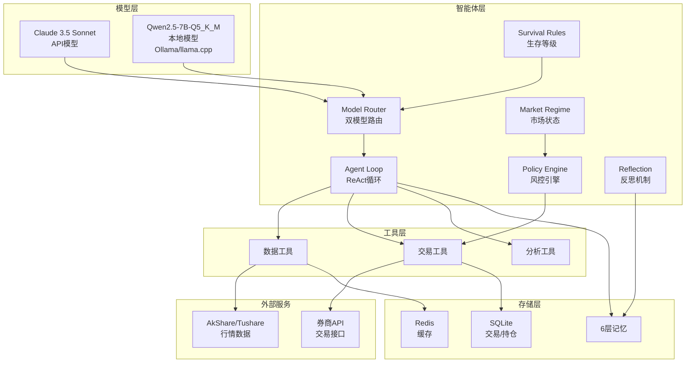
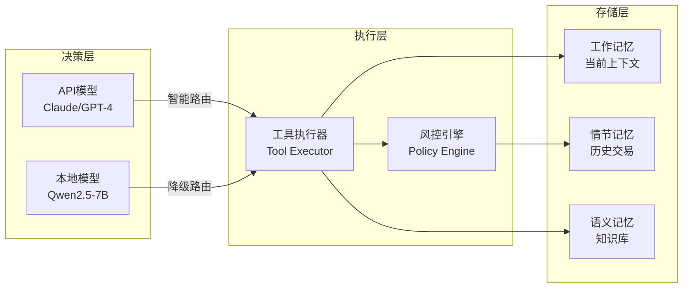
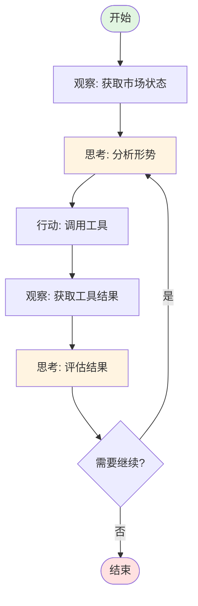
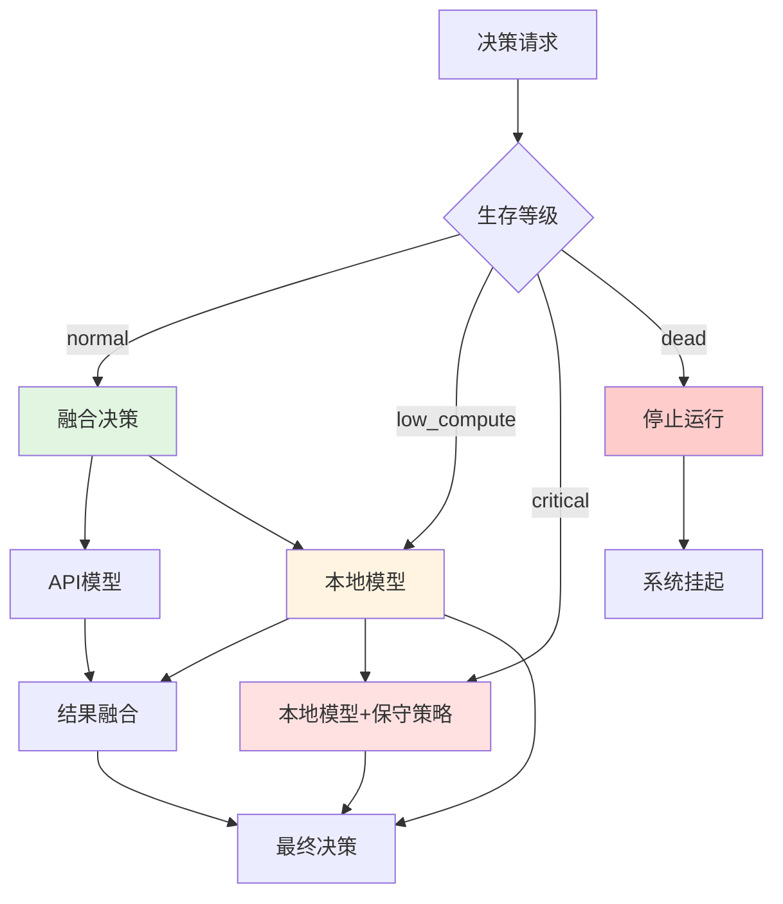
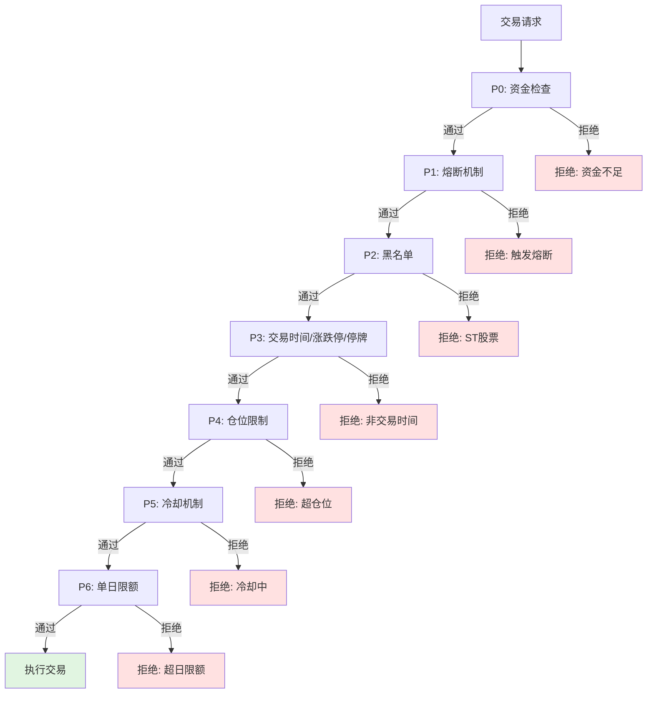
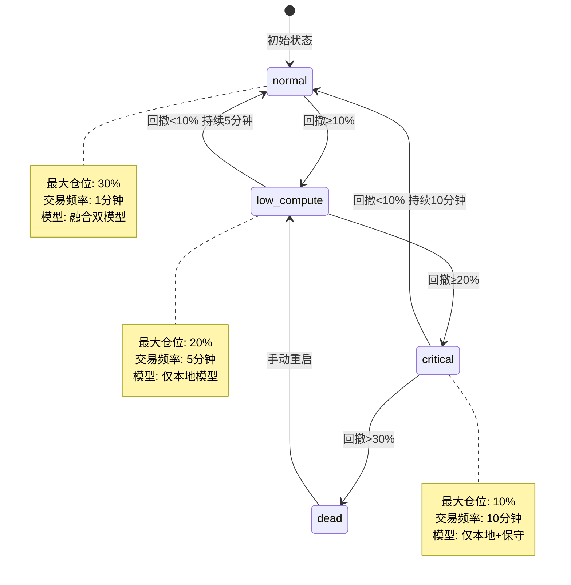
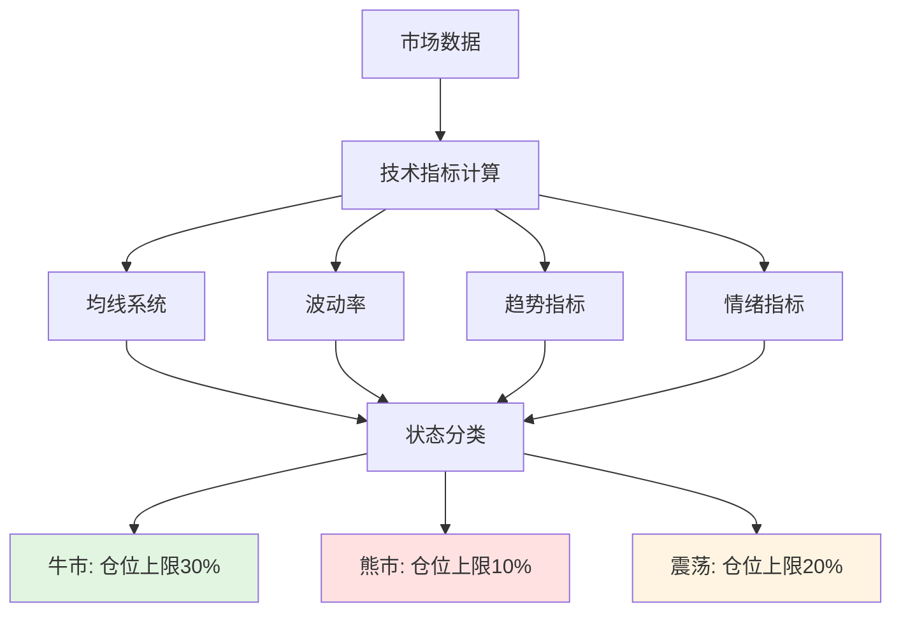
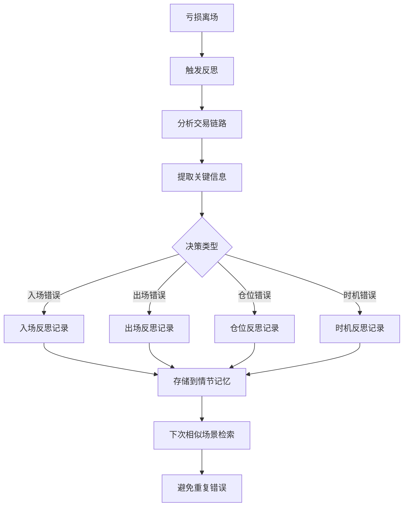
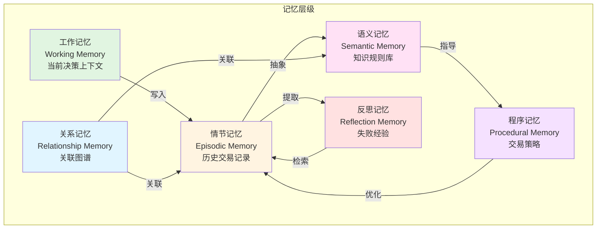

# AI Trader Agent - 架构设计文档

> **版本**: v1.0
> **日期**: 2024-03-23
> **状态**: 初稿
> **基于**: [PRD v1.2](./PRD.md)

---

## 1. 系统概述

### 1.1 架构原则

| 原则 | 说明 | 实现方式 |
|------|------|----------|
| **分层解耦** | 模型层、工具层、策略层分离 | Pydantic接口、依赖注入 |
| **可测试性** | 所有组件可独立测试 | Mock接口、pytest fixtures |
| **可观测性** | 完整的决策链路追踪 | 结构化日志、思维链输出 |
| **降级优先** | 危急状态自动降级 | 生存等级、模型路由 |
| **原子性** | 交易操作不可分割 | 数据库事务、状态机 |

### 1.2 技术栈总览



---

## 2. 核心架构

### 2.1 三层架构



#### 层级职责

| 层级 | 职责 | 核心组件 |
|------|------|----------|
| **决策层** | 市场分析、交易决策生成 | model_router.py, agent_loop.py |
| **执行层** | 工具调用、风控检查、交易执行 | tool_executor.py, policy_engine.py |
| **存储层** | 状态管理、历史记录、知识积累 | memory/, simulation/ |

### 2.2 ReAct 循环架构



**代码结构**:
```python
# core/agent_loop.py
class AgentLoop:
    async def react_loop(self, user_input: str) -> AgentResponse:
        """
        ReAct 循环实现

        1. Observe: 获取当前状态（持仓、行情、记忆）
        2. Think: 调用模型生成思考和行动
        3. Act: 执行工具调用
        4. Reflect: 更新记忆和状态
        """
        context = self._build_context()
        max_iterations = self._get_max_iterations()

        for i in range(max_iterations):
            # Think + Act
            decision = await self.model_router.generate_decision(context)

            if decision.is_final:
                break

            # Execute tool
            result = await self.tool_executor.execute(decision.tool_call)
            context = self._update_context(context, result)

        return self._build_response(context)
```

### 2.3 双模型路由架构



**Token 预算策略**:
```python
# core/model_router.py
class ModelRouter:
    """
    双模型路由器

    Token 预算分配（Claude 200K 上下文）:
    - 系统提示词: ~2K tokens
    - 工作记忆: ~10K tokens（最近决策、持仓状态）
    - 相关情节记忆: ~30K tokens（相似历史交易）
    - 相关语义记忆: ~20K tokens（知识规则）
    - 市场数据: ~50K tokens（实时行情、技术指标）
    - 预留输出: ~10K tokens
    - 缓冲: ~78K tokens
    """

    TOKEN_BUDGET = {
        "system": 2000,
        "working_memory": 10000,
        "episodic": 30000,
        "semantic": 20000,
        "market_data": 50000,
        "output": 10000,
        "buffer": 78000,
    }

    async def generate_decision(self, context: AgentContext) -> Decision:
        """
        根据生存等级路由到不同模型
        """
        survival_level = self.survival_rules.get_level(context.drawdown)

        if survival_level == "normal":
            # 融合决策: API模型分析 + 本地模型验证
            api_decision = await self._call_api_model(context)
            local_decision = await self._call_local_model(context)
            return self._merge_decisions(api_decision, local_decision)

        elif survival_level in ["low_compute", "critical"]:
            # 降级到本地模型
            return await self._call_local_model(context, conservative=True)

        else:  # dead
            raise SystemHaltedError("System halted due to critical drawdown")
```

---

## 3. 核心模块设计

### 3.1 风控引擎 (Policy Engine)



**优先级实现**:
```python
# core/policy_engine.py
from enum import IntEnum

class PolicyPriority(IntEnum):
    P0_FUND_CHECK = 0      # 资金检查
    P1_CIRCUIT_BREAKER = 1  # 熔断机制
    P2_BLACKLIST = 2        # 黑名单
    P3_TRADING_RULES = 3    # 交易时间/涨跌停/停牌
    P4_POSITION_LIMIT = 4   # 仓位限制
    P5_COOLDOWN = 5         # 冷却机制
    P6_DAILY_LIMIT = 6      # 单日限额

class PolicyEngine:
    """
    风控引擎

    所有风控规则按优先级顺序执行，任何规则失败立即拒绝
    """

    policies: List[BasePolicy] = [
        FundCheckPolicy(),          # P0
        CircuitBreakerPolicy(),     # P1
        BlacklistPolicy(),          # P2
        TradingRulesPolicy(),       # P3
        PositionLimitPolicy(),      # P4
        CooldownPolicy(),           # P5
        DailyLimitPolicy(),         # P6
    ]

    def validate_order(self, order: Order) -> PolicyResult:
        """
        按优先级顺序验证订单
        """
        for policy in sorted(self.policies, key=lambda p: p.priority):
            result = policy.check(order)
            if not result.allowed:
                return PolicyResult(
                    allowed=False,
                    reason=result.reason,
                    policy=policy.__class__.__name__
                )

        return PolicyResult(allowed=True)
```

### 3.2 生存等级系统



**状态机实现**:
```python
# core/survival_rules.py
from enum import Enum
from dataclasses import dataclass

class SurvivalLevel(Enum):
    NORMAL = "normal"
    LOW_COMPUTE = "low_compute"
    CRITICAL = "critical"
    DEAD = "dead"

@dataclass
class SurvivalState:
    level: SurvivalLevel
    drawdown: float
    max_position: float
    trading_interval: int  # 秒
    last_update: datetime

class SurvivalRules:
    """
    生存等级管理

    转换规则:
    - normal → low_compute: 回撤≥10%（立即）
    - low_compute → critical: 回撤≥20%（立即）
    - critical → dead: 回撤>30%（立即）
    - low_compute → normal: 回撤<10%持续5分钟
    - critical → normal: 回撤<10%持续10分钟
    - dead → low_compute: 用户手动重启
    """

    LEVEL_CONFIG = {
        SurvivalLevel.NORMAL: {
            "max_position": 0.30,
            "trading_interval": 60,
        },
        SurvivalLevel.LOW_COMPUTE: {
            "max_position": 0.20,
            "trading_interval": 300,
        },
        SurvivalLevel.CRITICAL: {
            "max_position": 0.10,
            "trading_interval": 600,
        },
        SurvivalLevel.DEAD: {
            "max_position": 0.0,
            "trading_interval": 0,
        },
    }

    def update_level(self, current_drawdown: float) -> SurvivalState:
        """
        根据当前回撤更新生存等级
        """
        current_level = self._get_current_level()

        # 升级到更危急状态（立即）
        if current_drawdown >= 0.30:
            new_level = SurvivalLevel.DEAD
        elif current_drawdown >= 0.20:
            new_level = SurvivalLevel.CRITICAL
        elif current_drawdown >= 0.10:
            new_level = SurvivalLevel.LOW_COMPUTE
        else:
            # 降级到正常状态（需要持续时间验证）
            if self._check_recovery_duration(current_drawdown):
                new_level = SurvivalLevel.NORMAL
            else:
                new_level = current_level

        return SurvivalState(
            level=new_level,
            drawdown=current_drawdown,
            **self.LEVEL_CONFIG[new_level],
            last_update=datetime.now()
        )
```

### 3.3 市场状态感知 (Market Regime)



**市场状态定义**:
```python
# core/market_regime.py
class MarketRegime(Enum):
    BULL = "bull"      # 牛市
    BEAR = "bear"      # 熊市
    SIDEWAYS = "sideways"  # 震荡

@dataclass
class MarketState:
    regime: MarketRegime
    confidence: float  # 0-1
    max_position_ratio: float
    indicators: Dict[str, float]

class MarketRegimeDetector:
    """
    市场状态感知

    判断依据:
    1. 大盘趋势: MA20/MA60/MA120 多头排列
    2. 波动率: ATR相对水平
    3. 成交量: 量能配合
    4. 涨跌家数比: 市场情绪
    """

    def detect(self, market_data: MarketData) -> MarketState:
        """
        检测当前市场状态
        """
        # 计算技术指标
        ma_trend = self._calculate_ma_trend(market_data)
        volatility = self._calculate_volatility(market_data)
        breadth = self._calculate_market_breadth(market_data)

        # 综合判断
        if ma_trend.bullish and breadth.strong:
            regime = MarketRegime.BULL
            max_ratio = 0.30
        elif ma_trend.bearish or breadth.weak:
            regime = MarketRegime.BEAR
            max_ratio = 0.10
        else:
            regime = MarketRegime.SIDEWAYS
            max_ratio = 0.20

        return MarketState(
            regime=regime,
            confidence=self._calculate_confidence(ma_trend, volatility, breadth),
            max_position_ratio=max_ratio,
            indicators={
                "ma_trend": ma_trend.score,
                "volatility": volatility.value,
                "breadth": breadth.score,
            }
        )
```

### 3.4 反思机制 (Reflection)



**反思实现**:
```python
# core/reflection.py
from dataclasses import dataclass
from typing import Literal

@dataclass
class ReflectionRecord:
    """反思记录"""
    trade_id: str
    loss_amount: float
    loss_ratio: float
    error_type: Literal["entry", "exit", "position", "timing"]
    analysis: str
    lesson: str
    avoid_action: str
    timestamp: datetime

class ReflectionEngine:
    """
    反思机制

    触发条件:
    - 单笔交易亏损≥5%
    - 连续3笔亏损

    反思内容:
    1. 交易决策链路分析
    2. 错误类型分类
    3. 改进建议生成
    4. 存储到情节记忆供后续检索
    """

    LOSS_THRESHOLD = 0.05  # 5%
    CONSECUTIVE_LOSS = 3

    async def reflect_on_loss(self, trade: Trade, memory: MemorySystem) -> ReflectionRecord:
        """
        对亏损交易进行反思
        """
        # 1. 分析交易决策链路
        decision_chain = await memory.episodic.get_decision_chain(trade.id)

        # 2. 识别错误类型
        error_type = self._classify_error(decision_chain, trade)

        # 3. 生成反思内容
        reflection = await self._generate_reflection(decision_chain, trade, error_type)

        # 4. 存储到情节记忆
        await memory.episodic.store_reflection(reflection)

        return reflection

    def _classify_error(self, chain: DecisionChain, trade: Trade) -> str:
        """
        分类错误类型
        """
        if trade.pnl_ratio < -0.05 and trade.holding_duration < pd.Timedelta(hours=2):
            return "entry"  # 入场时机错误
        elif trade.entry_price > trade.max_price * 0.95:
            return "timing"  # 追高
        elif trade.position_ratio > 0.2:
            return "position"  # 仓位过重
        else:
            return "exit"  # 出场决策错误
```

---

## 4. 数据架构

### 4.1 6层记忆系统



**记忆接口定义**:
```python
# core/memory/base.py
from abc import ABC, abstractmethod
from typing import List, Optional

class MemoryBase(ABC):
    """记忆基类"""

    @abstractmethod
    async def store(self, data: Any) -> str:
        """存储数据，返回记忆ID"""
        pass

    @abstractmethod
    async def retrieve(self, memory_id: str) -> Optional[Any]:
        """根据ID检索记忆"""
        pass

    @abstractmethod
    async def search(self, query: str, k: int = 5) -> List[Any]:
        """语义搜索相似记忆"""
        pass

class WorkingMemory(MemoryBase):
    """
    工作记忆

    存储:
    - 当前决策链路
    - 当前持仓状态
    - 当前关注股票
    - 临时计算结果

    特点:
    - 容量小（最近10条决策）
    - 快速读写
    - 自动滚动覆盖
    """
    MAX_ITEMS = 10

class EpisodicMemory(MemoryBase):
    """
    情节记忆

    存储:
    - 完整交易记录
    - 决策链路（思考过程）
    - 市场状态快照
    - 反思记录

    特点:
    - 时间序列索引
    - 按场景检索（相似市场条件）
    - 向量嵌入语义搜索
    """
    INDEX_FIELDS = ["timestamp", "symbol", "regime", "outcome"]

class SemanticMemory(MemoryBase):
    """
    语义记忆

    存储:
    - 交易规则和知识
    - 技术分析理论
    - 风控原则
    - 市场规律总结

    特点:
    - 去重存储
    - 按主题分类
    - 知识图谱关联
    """
    CATEGORIES = ["strategy", "risk", "analysis", "market"]

class ProceduralMemory(MemoryBase):
    """
    程序记忆

    存储:
    - 成功的交易策略
    - 技术指标组合
    - 入场/出场模式

    特点:
    - 可执行代码
    - 参数化配置
    - 绩效追踪
    """
    def store_strategy(self, strategy: TradingStrategy) -> str:
        """存储可执行策略"""
        pass

    def retrieve_strategies_by_performance(self, min_sharpe: float) -> List[TradingStrategy]:
        """检索高绩效策略"""
        pass

class RelationshipMemory(MemoryBase):
    """
    关系记忆

    存储:
    - 股票关联关系（板块、概念）
    - 指标相关性
    - 市场因果关系

    特点:
    - 图数据库结构
    - 关系强度权重
    - 动态更新
    """
    def add_relation(self, entity_a: str, entity_b: str, relation_type: str, strength: float):
        """添加关系"""
        pass

    def get_related_entities(self, entity: str, relation_type: str, depth: int = 2) -> List[str]:
        """获取关联实体"""
        pass

class ReflectionMemory(MemoryBase):
    """
    反思记忆

    存储:
    - 失败交易分析
    - 错误模式识别
    - 改进建议

    特点:
    - 按错误类型索引
    - 主动检索避免重复
    - 与情节记忆关联
    """
    ERROR_TYPES = ["entry", "exit", "position", "timing"]
```

### 4.2 数据库设计

#### SQLite Schema

```sql
-- ============================================
-- 交易相关表
-- ============================================

-- 持仓表
CREATE TABLE positions (
    id INTEGER PRIMARY KEY AUTOINCREMENT,
    symbol TEXT NOT NULL,              -- 股票代码
    shares INTEGER NOT NULL,           -- 持股数量
    avg_cost REAL NOT NULL,            -- 平均成本
    current_price REAL,                -- 当前价格
    market_value REAL,                 -- 市值
    pnl REAL DEFAULT 0,                -- 浮动盈亏
    pnl_ratio REAL DEFAULT 0,          -- 盈亏比例
    opened_at TIMESTAMP NOT NULL,      -- 建仓时间
    updated_at TIMESTAMP DEFAULT CURRENT_TIMESTAMP,
    UNIQUE(symbol)
);

-- 交易记录表
CREATE TABLE trades (
    id INTEGER PRIMARY KEY AUTOINCREMENT,
    trade_id TEXT UNIQUE NOT NULL,     -- 交易唯一ID
    symbol TEXT NOT NULL,
    side TEXT NOT NULL,                -- 'buy' | 'sell'
    shares INTEGER NOT NULL,
    price REAL NOT NULL,
    amount REAL NOT NULL,              -- 交易金额
    timestamp TIMESTAMP NOT NULL,
    decision_chain TEXT,               -- 决策链路JSON
    regime TEXT,                       -- 市场状态
    survival_level TEXT,               -- 生存等级
    model_used TEXT,                   -- 使用的模型
    created_at TIMESTAMP DEFAULT CURRENT_TIMESTAMP
);

-- 订单表
CREATE TABLE orders (
    id INTEGER PRIMARY KEY AUTOINCREMENT,
    order_id TEXT UNIQUE NOT NULL,
    trade_id TEXT,                     -- 关联交易ID
    symbol TEXT NOT NULL,
    side TEXT NOT NULL,
    quantity INTEGER NOT NULL,
    price REAL,
    order_type TEXT NOT NULL,          -- 'market' | 'limit'
    status TEXT NOT NULL,              -- 'pending' | 'filled' | 'cancelled' | 'rejected'
    filled_quantity INTEGER DEFAULT 0,
    filled_price REAL,
    reject_reason TEXT,
    created_at TIMESTAMP DEFAULT CURRENT_TIMESTAMP,
    filled_at TIMESTAMP,
    FOREIGN KEY (trade_id) REFERENCES trades(trade_id)
);

-- ============================================
-- 记忆相关表
-- ============================================

-- 决策记录表（情节记忆）
CREATE TABLE decisions (
    id INTEGER PRIMARY KEY AUTOINCREMENT,
    decision_id TEXT UNIQUE NOT NULL,
    timestamp TIMESTAMP NOT NULL,
    context TEXT,                      -- 决策上下文JSON
    thought_process TEXT,              -- 思考过程
    action_taken TEXT,                 -- 执行的行动
    result TEXT,                       -- 执行结果
    outcome TEXT,                      -- 最终结果
    related_trade_id TEXT,             -- 关联交易
    embedding BLOB,                    -- 向量嵌入（用于语义搜索）
    FOREIGN KEY (related_trade_id) REFERENCES trades(trade_id)
);

-- 反思记录表
CREATE TABLE reflections (
    id INTEGER PRIMARY KEY AUTOINCREMENT,
    reflection_id TEXT UNIQUE NOT NULL,
    trade_id TEXT NOT NULL,
    loss_amount REAL NOT NULL,
    loss_ratio REAL NOT NULL,
    error_type TEXT NOT NULL,
    analysis TEXT,
    lesson TEXT,
    avoid_action TEXT,
    timestamp TIMESTAMP DEFAULT CURRENT_TIMESTAMP,
    FOREIGN KEY (trade_id) REFERENCES trades(trade_id)
);

-- 知识库表（语义记忆）
CREATE TABLE knowledge (
    id INTEGER PRIMARY KEY AUTOINCREMENT,
    knowledge_id TEXT UNIQUE NOT NULL,
    category TEXT NOT NULL,            -- 'strategy' | 'risk' | 'analysis' | 'market'
    title TEXT NOT NULL,
    content TEXT NOT NULL,
    source TEXT,                       -- 来源（人工/总结）
    confidence REAL DEFAULT 0.5,       -- 置信度
    created_at TIMESTAMP DEFAULT CURRENT_TIMESTAMP,
    updated_at TIMESTAMP DEFAULT CURRENT_TIMESTAMP,
    UNIQUE(category, title)
);

-- ============================================
-- 系统状态表
-- ============================================

-- 账户状态表
CREATE TABLE account_state (
    id INTEGER PRIMARY KEY AUTOINCREMENT,
    date DATE UNIQUE NOT NULL,
    initial_cash REAL NOT NULL,
    current_cash REAL NOT NULL,
    total_value REAL NOT NULL,
    total_pnl REAL DEFAULT 0,
    total_pnl_ratio REAL DEFAULT 0,
    max_drawdown REAL DEFAULT 0,
    survival_level TEXT DEFAULT 'normal',
    market_regime TEXT,
    updated_at TIMESTAMP DEFAULT CURRENT_TIMESTAMP
);

-- 系统事件表
CREATE TABLE system_events (
    id INTEGER PRIMARY KEY AUTOINCREMENT,
    event_type TEXT NOT NULL,          -- 'survival_change' | 'regime_change' | 'error' | 'warning'
    event_level TEXT NOT NULL,         -- 'info' | 'warning' | 'error' | 'critical'
    message TEXT NOT NULL,
    details TEXT,                      -- JSON格式详细信息
    timestamp TIMESTAMP DEFAULT CURRENT_TIMESTAMP
);

-- ============================================
-- 索引
-- ============================================

CREATE INDEX idx_positions_symbol ON positions(symbol);
CREATE INDEX idx_trades_symbol ON trades(symbol);
CREATE INDEX idx_trades_timestamp ON trades(timestamp);
CREATE INDEX idx_orders_status ON orders(status);
CREATE INDEX idx_decisions_timestamp ON decisions(timestamp);
CREATE INDEX idx_decisions_trade ON decisions(related_trade_id);
CREATE INDEX idx_reflections_trade ON reflections(trade_id);
CREATE INDEX idx_reflections_type ON reflections(error_type);
CREATE INDEX idx_knowledge_category ON knowledge(category);
CREATE INDEX idx_events_type ON system_events(event_type);
CREATE INDEX idx_events_timestamp ON system_events(timestamp);
```

#### Redis 缓存结构

```python
# utils/redis_client.py
class RedisCache:
    """
    Redis 缓存结构

    用途:
    - 实时行情缓存（TTL: 5秒）
    - 技术指标缓存（TTL: 1分钟）
    - 持仓状态缓存（TTL: 10秒）
    - 会话状态（无过期）
    """

    # 实时行情（Hash）
    # Key: quote:{symbol}
    # Fields: price, change, change_ratio, volume, amount, high, low, open, timestamp
    # TTL: 5秒
    QUOTE_KEY = "quote:{symbol}"
    QUOTE_TTL = 5

    # 技术指标（Hash）
    # Key: indicator:{symbol}:{period}
    # Fields: ma5, ma10, ma20, ma60, macd, dif, dea, rsi, kdj_k, kdj_d, kdj_j, atr
    # TTL: 60秒
    INDICATOR_KEY = "indicator:{symbol}:{period}"
    INDICATOR_TTL = 60

    # 持仓状态（Hash）
    # Key: positions
    # Fields: {json格式的所有持仓}
    # TTL: 10秒
    POSITIONS_KEY = "positions"
    POSITIONS_TTL = 10

    # 会话状态（String）
    # Key: session:{session_id}
    # Value: JSON格式的会话数据
    # TTL: 24小时
    SESSION_KEY = "session:{session_id}"
    SESSION_TTL = 86400

    # 市场状态（String）
    # Key: market_state
    # Value: JSON格式（regime, confidence, max_position_ratio）
    # TTL: 60秒
    MARKET_STATE_KEY = "market_state"
    MARKET_STATE_TTL = 60

    # 生存状态（String）
    # Key: survival_state
    # Value: JSON格式（level, drawdown, max_position, trading_interval）
    # TTL: 10秒
    SURVIVAL_STATE_KEY = "survival_state"
    SURVIVAL_STATE_TTL = 10
```

---

## 5. 工具架构

### 5.1 工具接口定义

```python
# tools/base.py
from abc import ABC, abstractmethod
from typing import TypeVar, Generic

T = TypeVar('T')

class Tool(ABC, Generic[T]):
    """工具基类"""

    @property
    @abstractmethod
    def name(self) -> str:
        """工具名称"""
        pass

    @property
    @abstractmethod
    def description(self) -> str:
        """工具描述（用于模型理解）"""
        pass

    @property
    @abstractmethod
    def parameters_schema(self) -> dict:
        """参数JSON Schema"""
        pass

    @abstractmethod
    async def execute(self, **kwargs) -> ToolResult[T]:
        """
        执行工具

        Returns:
            ToolResult: 包含成功状态、数据、错误信息
        """
        pass

@dataclass
class ToolResult(Generic[T]):
    """工具执行结果"""
    success: bool
    data: Optional[T] = None
    error: Optional[str] = None
    execution_time: float = 0.0
```

### 5.2 核心工具实现

```python
# tools/data/get_quote.py
class GetQuoteTool(Tool[QuoteData]):
    """
    获取股票实时行情

    参数:
        symbol: 股票代码（如 "600519"）
        fields: 可选字段列表（默认全部）

    返回:
        QuoteData: 包含价格、涨跌幅、成交量等
    """

    name = "get_quote"
    description = "获取股票实时行情数据，包括当前价格、涨跌幅、成交量、成交额等信息"

    parameters_schema = {
        "type": "object",
        "properties": {
            "symbol": {
                "type": "string",
                "description": "股票代码，如 600519（贵州茅台）"
            },
            "fields": {
                "type": "array",
                "items": {"type": "string"},
                "description": "可选字段列表，如 ['price', 'change', 'volume']",
                "default": None
            }
        },
        "required": ["symbol"]
    }

    def __init__(self, cache: RedisCache):
        self.cache = cache
        self.akshare = akshare

    async def execute(self, symbol: str, fields: Optional[List[str]] = None) -> ToolResult[QuoteData]:
        """
        执行获取行情
        """
        try:
            # 先查缓存
            cached = await self.cache.hgetall(f"quote:{symbol}")
            if cached:
                data = QuoteData.parse_raw(cached)
                return ToolResult(success=True, data=data, execution_time=0.001)

            # 缓存未命中，调用AkShare
            start_time = time.time()
            df = self.akshare.stock_zh_a_spot_em()
            row = df[df['代码'] == symbol]

            if row.empty:
                return ToolResult(success=False, error=f"股票代码 {symbol} 不存在")

            data = QuoteData(
                symbol=symbol,
                name=row.iloc[0]['名称'],
                price=row.iloc[0]['最新价'],
                change=row.iloc[0]['涨跌幅'],
                volume=row.iloc[0]['成交量'],
                amount=row.iloc[0]['成交额'],
                high=row.iloc[0]['最高'],
                low=row.iloc[0]['最低'],
                open=row.iloc[0]['今开'],
                timestamp=datetime.now()
            )

            # 写入缓存
            await self.cache.hset(f"quote:{symbol}", data.dict())
            await self.cache.expire(f"quote:{symbol}", 5)

            execution_time = time.time() - start_time
            return ToolResult(success=True, data=data, execution_time=execution_time)

        except Exception as e:
            return ToolResult(success=False, error=str(e))

# tools/trading/place_order.py
class PlaceOrderTool(Tool[OrderResult]):
    """
    下单交易

    参数:
        symbol: 股票代码
        side: 买卖方向 ('buy' | 'sell')
        quantity: 数量（股）
        price: 价格（限价单，市价单为None）
        order_type: 订单类型 ('market' | 'limit')

    返回:
        OrderResult: 订单ID、成交情况
    """

    name = "place_order"
    description = "提交股票交易订单，支持买入和卖出，市价单和限价单"

    parameters_schema = {
        "type": "object",
        "properties": {
            "symbol": {"type": "string", "description": "股票代码"},
            "side": {"type": "string", "enum": ["buy", "sell"], "description": "买卖方向"},
            "quantity": {"type": "integer", "description": "买入/卖出股数"},
            "price": {"type": "number", "description": "限价单价格，市价单为null"},
            "order_type": {"type": "string", "enum": ["market", "limit"], "description": "订单类型"}
        },
        "required": ["symbol", "side", "quantity", "order_type"]
    }

    def __init__(self, policy_engine: PolicyEngine, account: Account, matcher: Matcher):
        self.policy = policy_engine
        self.account = account
        self.matcher = matcher

    async def execute(self, symbol: str, side: str, quantity: int,
                     price: Optional[float], order_type: str) -> ToolResult[OrderResult]:
        """
        执行下单
        """
        try:
            # 1. 构建订单
            order = Order(
                order_id=generate_id(),
                symbol=symbol,
                side=side,
                quantity=quantity,
                price=price,
                order_type=order_type,
                status="pending"
            )

            # 2. 风控检查
            policy_result = self.policy.validate_order(order)
            if not policy_result.allowed:
                order.status = "rejected"
                order.reject_reason = policy_result.reason
                return ToolResult(
                    success=False,
                    error=f"订单被风控拒绝: {policy_result.reason}",
                    data=OrderResult(order=order, filled_quantity=0, filled_price=None)
                )

            # 3. 检查资金/持仓
            if side == "buy":
                if not self.account.check_sufficient_cash(order.estimated_amount):
                    return ToolResult(success=False, error="资金不足")
            else:  # sell
                if not self.account.check_sufficient_position(symbol, quantity):
                    return ToolResult(success=False, error="持仓不足")

            # 4. 提交到撮合引擎
            match_result = await self.matcher.match(order)

            # 5. 更新账户
            if match_result.filled_quantity > 0:
                self.account.update_from_trade(match_result)

            order.status = "filled" if match_result.fully_filled else "partially_filled"
            order.filled_quantity = match_result.filled_quantity
            order.filled_price = match_result.filled_price

            return ToolResult(
                success=True,
                data=OrderResult(
                    order=order,
                    filled_quantity=match_result.filled_quantity,
                    filled_price=match_result.filled_price
                )
            )

        except Exception as e:
            return ToolResult(success=False, error=str(e))

# tools/trading/get_positions.py
class GetPositionsTool(Tool[List[Position]]):
    """
    获取当前持仓

    参数: 无

    返回:
        List[Position]: 持仓列表
    """

    name = "get_positions"
    description = "获取当前所有持仓，包括股票代码、数量、成本、盈亏等信息"

    parameters_schema = {
        "type": "object",
        "properties": {},
        "required": []
    }

    def __init__(self, account: Account):
        self.account = account

    async def execute(self) -> ToolResult[List[Position]]:
        """
        执行获取持仓
        """
        try:
            positions = await self.account.get_positions()
            return ToolResult(success=True, data=positions)
        except Exception as e:
            return ToolResult(success=False, error=str(e))
```

### 5.3 工具执行器

```python
# core/tool_executor.py
class ToolExecutor:
    """
    工具执行器

    职责:
    1. 工具注册与查找
    2. 参数校验
    3. 执行调度
    4. 结果处理与日志
    """

    def __init__(self):
        self.tools: Dict[str, Tool] = {}
        self._register_default_tools()

    def register_tool(self, tool: Tool):
        """注册工具"""
        self.tools[tool.name] = tool

    def _register_default_tools(self):
        """注册默认工具"""
        # Phase 1: 3个核心工具
        # self.register_tool(GetQuoteTool(cache))
        # self.register_tool(PlaceOrderTool(policy, account, matcher))
        # self.register_tool(GetPositionsTool(account))

    async def execute(self, tool_call: ToolCall) -> ToolResult:
        """
        执行工具调用

        Args:
            tool_call: 包含工具名称和参数的调用请求

        Returns:
            ToolResult: 执行结果
        """
        tool_name = tool_call.name
        params = tool_call.parameters

        # 1. 查找工具
        if tool_name not in self.tools:
            return ToolResult(success=False, error=f"工具 {tool_name} 不存在")

        tool = self.tools[tool_name]

        # 2. 参数校验
        try:
            jsonschema.validate(params, tool.parameters_schema)
        except jsonschema.ValidationError as e:
            return ToolResult(success=False, error=f"参数校验失败: {e.message}")

        # 3. 执行工具
        logger.info(f"执行工具: {tool_name} 参数: {params}")
        start_time = time.time()

        try:
            result = await tool.execute(**params)
            execution_time = time.time() - start_time
            result.execution_time = execution_time

            if result.success:
                logger.info(f"工具 {tool_name} 执行成功，耗时 {execution_time:.3f}s")
            else:
                logger.warning(f"工具 {tool_name} 执行失败: {result.error}")

            return result

        except Exception as e:
            logger.error(f"工具 {tool_name} 执行异常: {e}", exc_info=True)
            return ToolResult(success=False, error=f"执行异常: {str(e)}")
```

---

## 6. 模拟交易架构

### 6.1 账户系统

```python
# simulation/account.py
class Account:
    """
    模拟账户

    特性:
    - 原子性操作（事务）
    - 资金锁定机制
    - 持仓管理
    - 盈亏计算
    """

    def __init__(self, initial_cash: float, db_path: str):
        self.initial_cash = initial_cash
        self.current_cash = initial_cash
        self.db = sqlite3.connect(db_path)
        self._create_tables()
        self._load_positions()

    @contextmanager
    def _transaction(self):
        """事务上下文管理器"""
        cursor = self.db.cursor()
        try:
            cursor.execute("BEGIN IMMEDIATE")
            yield cursor
            self.db.commit()
        except Exception:
            self.db.rollback()
            raise

    def update_from_trade(self, match_result: MatchResult) -> bool:
        """
        从交易结果更新账户（原子操作）

        Args:
            match_result: 撮合结果

        Returns:
            是否更新成功
        """
        with self._transaction() as cursor:
            if match_result.side == "buy":
                # 买入: 扣减资金，增加持仓
                cost = match_result.filled_quantity * match_result.filled_price
                cursor.execute(
                    "UPDATE account SET current_cash = current_cash - ? WHERE id = 1",
                    (cost,)
                )

                cursor.execute(
                    """
                    INSERT INTO positions (symbol, shares, avg_cost, opened_at)
                    VALUES (?, ?, ?, ?)
                    ON CONFLICT(symbol) DO UPDATE SET
                        shares = shares + ?,
                        avg_cost = (avg_cost * shares + ?) / (shares + ?)
                    """,
                    (match_result.symbol, match_result.filled_quantity,
                     match_result.filled_price, datetime.now(),
                     match_result.filled_quantity, cost,
                     match_result.filled_quantity)
                )

            else:  # sell
                # 卖出: 增加资金，减少持仓
                proceeds = match_result.filled_quantity * match_result.filled_price
                cursor.execute(
                    "UPDATE account SET current_cash = current_cash + ? WHERE id = 1",
                    (proceeds,)
                )

                cursor.execute(
                    "UPDATE positions SET shares = shares - ? WHERE symbol = ?",
                    (match_result.filled_quantity, match_result.symbol)
                )

                # 清空零持仓
                cursor.execute(
                    "DELETE FROM positions WHERE shares = 0"
                )

            self.current_cash = cursor.execute(
                "SELECT current_cash FROM account WHERE id = 1"
            ).fetchone()[0]

            return True
```

### 6.2 撮合引擎

```python
# simulation/matcher.py
class Matcher:
    """
    撮合引擎

    职责:
    1. 接收订单
    2. 模拟撮合（T+1规则）
    3. 生成成交记录
    """

    def __init__(self, market_data: MarketDataSource):
        self.market = market_data
        self.order_book: Dict[str, OrderBook] = {}

    async def match(self, order: Order) -> MatchResult:
        """
        撮合订单

        规则:
        - 市价单: 以当前最新价成交
        - 限价单: 以限价或更优价格成交
        - T+1: 当日买入只能次日卖出
        - 涨跌停: 超过涨跌停价的订单无法成交
        """
        # 获取实时行情
        quote = await self.market.get_quote(order.symbol)

        # 检查涨跌停
        if order.side == "buy" and order.price and order.price >= quote.upper_limit:
            return MatchResult(
                order=order,
                filled_quantity=0,
                filled_price=None,
                fully_filled=False,
                reason="价格达到涨停板，无法买入"
            )

        if order.side == "sell" and order.price and order.price <= quote.lower_limit:
            return MatchResult(
                order=order,
                filled_quantity=0,
                filled_price=None,
                fully_filled=False,
                reason="价格达到跌停板，无法卖出"
            )

        # 确定成交价格
        if order.order_type == "market":
            execution_price = quote.price
        else:  # limit
            if order.side == "buy":
                execution_price = min(order.price, quote.price)
            else:
                execution_price = max(order.price, quote.price)

        # 计算成交数量
        filled_quantity = min(order.quantity, self._get_available_volume(order.symbol))

        return MatchResult(
            order=order,
            filled_quantity=filled_quantity,
            filled_price=execution_price,
            fully_filled=filled_quantity == order.quantity,
            reason="成交成功"
        )

    def _get_available_volume(self, symbol: str) -> int:
        """
        获取可用成交量（模拟）
        """
        # 简化处理：假设盘口深度充足
        return 1000000
```

---

## 7. 部署架构

### 7.1 本地部署

```
┌─────────────────────────────────────────────────────────┐
│                    用户机器                              │
├─────────────────────────────────────────────────────────┤
│                                                          │
│  ┌──────────────────────────────────────────────────┐  │
│  │          AI Trader Agent (Python)                │  │
│  │                                                  │  │
│  │  ┌────────────┐  ┌────────────┐  ┌────────────┐ │  │
│  │  │ Agent Loop │  │ Model      │  │ Tool       │ │  │
│  │  │            │  │ Router     │  │ Executor   │ │  │
│  │  └────────────┘  └────────────┘  └────────────┘ │  │
│  └──────────────────────────────────────────────────┘  │
│           │                    │                        │
│           ▼                    ▼                        │
│  ┌────────────┐      ┌─────────────┐                   │
│  │  Ollama    │      │  Redis      │                   │
│  │  (本地模型) │      │  (缓存)     │                   │
│  └────────────┘      └─────────────┘                   │
│           │                                             │
│           ▼                                             │
│  ┌──────────────────────────────────────────────────┐  │
│  │            SQLite (数据存储)                     │  │
│  └──────────────────────────────────────────────────┘  │
│                                                         │
│  ┌──────────────────────────────────────────────────┐  │
│  │       Streamlit Dashboard (监控面板)             │  │
│  └──────────────────────────────────────────────────┘  │
│                                                         │
└─────────────────────────────────────────────────────────┘
          │                              │
          │ HTTPS                        │ HTTPS
          ▼                              ▼
┌─────────────────┐            ┌─────────────────┐
│  Claude API     │            │  AkShare/Tushare│
│  (远程调用)      │            │  (数据源)        │
└─────────────────┘            └─────────────────┘
```

### 7.2 环境配置

```bash
# .env.example
# ============================================
# API 配置
# ============================================
ANTHROPIC_API_KEY=sk-ant-xxx
OPENAI_API_KEY=sk-xxx

# ============================================
# 本地模型配置
# ============================================
OLLAMA_BASE_URL=http://localhost:11434
LOCAL_MODEL_NAME=qwen2.5:7b-q5_K_M
LOCAL_MODEL_PATH=D:/Models/Qwen2.5-7B-Instruct-Q5_K_M.gguf

# ============================================
# 数据库配置
# ============================================
SQLITE_DB_PATH=data/trading.db
REDIS_HOST=localhost
REDIS_PORT=6379
REDIS_DB=0

# ============================================
# 数据源配置
# ============================================
TUSHARE_TOKEN=xxx  # 可选
AKSHARE_ENABLED=true

# ============================================
# 账户配置
# ============================================
INITIAL_CASH=1000000.0
COMMISSION_RATE=0.0003  # 万三佣金

# ============================================
# 日志配置
# ============================================
LOG_LEVEL=INFO
LOG_FILE=logs/trader.log
```

### 7.3 启动流程

```bash
# 1. 安装依赖
pip install -r requirements.txt

# 2. 启动 Ollama 服务（本地模型）
ollama serve

# 3. 启动 Redis（缓存）
redis-server

# 4. 更新数据（获取前一日行情）
python scripts/update_data.py --date 2024-03-22

# 5. 启动 Agent
python -m core.main

# 6. 启动监控面板（另开终端）
streamlit run monitoring/dashboard.py
```

---

## 8. API 规范

### 8.1 数据模型

```python
# core/schemas.py
from pydantic import BaseModel, Field
from typing import Optional, Literal
from datetime import datetime

class QuoteData(BaseModel):
    """行情数据"""
    symbol: str = Field(..., description="股票代码")
    name: str = Field(..., description="股票名称")
    price: float = Field(..., description="最新价")
    change: float = Field(..., description="涨跌幅(%)")
    volume: int = Field(..., description="成交量(手)")
    amount: float = Field(..., description="成交额(元)")
    high: Optional[float] = Field(None, description="最高价")
    low: Optional[float] = Field(None, description="最低价")
    open: Optional[float] = Field(None, description="开盘价")
    timestamp: datetime = Field(default_factory=datetime.now)

class Order(BaseModel):
    """订单"""
    order_id: str
    symbol: str
    side: Literal["buy", "sell"]
    quantity: int
    price: Optional[float]
    order_type: Literal["market", "limit"]
    status: Literal["pending", "filled", "partially_filled", "cancelled", "rejected"]
    filled_quantity: int = 0
    filled_price: Optional[float] = None
    reject_reason: Optional[str] = None
    created_at: datetime = Field(default_factory=datetime.now)

class Position(BaseModel):
    """持仓"""
    symbol: str
    shares: int
    avg_cost: float
    current_price: float
    market_value: float
    pnl: float
    pnl_ratio: float
    opened_at: datetime

class AgentResponse(BaseModel):
    """Agent 响应"""
    success: bool
    message: str
    thought_process: Optional[str] = None
    actions_taken: List[str] = []
    final_result: Optional[dict] = None
    execution_time: float
    timestamp: datetime = Field(default_factory=datetime.now)
```

### 8.2 组件接口

```python
# core/interfaces.py
from abc import ABC, abstractmethod

class IModelRouter(ABC):
    """模型路由器接口"""

    @abstractmethod
    async def generate_decision(self, context: AgentContext) -> Decision:
        """生成交易决策"""
        pass

class IPolicyEngine(ABC):
    """风控引擎接口"""

    @abstractmethod
    def validate_order(self, order: Order) -> PolicyResult:
        """验证订单"""
        pass

class IMemorySystem(ABC):
    """记忆系统接口"""

    @abstractmethod
    async def store_working(self, data: Any) -> str:
        """存储工作记忆"""
        pass

    @abstractmethod
    async def retrieve_episodic(self, query: str, k: int = 5) -> List[EpisodicMemory]:
        """检索情节记忆"""
        pass

class IMarketDataSource(ABC):
    """行情数据源接口"""

    @abstractmethod
    async def get_quote(self, symbol: str) -> QuoteData:
        """获取实时行情"""
        pass

    @abstractmethod
    async def get_historical(self, symbol: str, start_date: str, end_date: str) -> pd.DataFrame:
        """获取历史数据"""
        pass
```

---

## 9. 安全考虑

### 9.1 风控强制执行

```python
# core/policy_engine/enforcement.py
class PolicyEnforcement:
    """
    风控强制执行

    原则:
    - 风控规则不可绕过
    - 任何渠道进入的订单都需检查
    - 关键操作需要审计日志
    """

    def __init__(self, engine: PolicyEngine):
        self.engine = engine
        self.audit_log = AuditLogger()

    def enforced_validate(self, order: Order) -> PolicyResult:
        """
        强制风控检查（带审计）
        """
        # 记录审计日志
        self.audit_log.log_order_submission(order)

        # 执行风控检查
        result = self.engine.validate_order(order)

        # 记录结果
        self.audit_log.log_policy_result(order, result)

        # 如果是拒绝，确保订单不会执行
        if not result.allowed:
            order.status = "rejected"
            order.reject_reason = result.reason
            self.audit_log.log_order_rejection(order, result)

        return result
```

### 9.2 数据验证

```python
# utils/validation.py
class DataValidator:
    """
    数据验证

    边界:
    - 系统边界: 用户输入、API响应、文件读取
    """

    @staticmethod
    def validate_symbol(symbol: str) -> bool:
        """
        验证股票代码格式
        """
        return bool(re.match(r"^\d{6}$", symbol))

    @staticmethod
    def validate_quantity(quantity: int) -> bool:
        """
        验证交易数量（必须是100的整数倍）
        """
        return quantity > 0 and quantity % 100 == 0

    @staticmethod
    def validate_price(price: float) -> bool:
        """
        验证价格（必须大于0，且符合最小价位）
        """
        return price > 0 and price * 100 % 1 == 0  # 最小价位0.01元
```

### 9.3 API 密钥管理

```python
# utils/secrets.py
import os
from dotenv import load_dotenv

load_dotenv()

class Secrets:
    """
    敏感信息管理

    原则:
    - 不在代码中硬编码密钥
    - 使用环境变量
    - 启动时验证必需密钥存在
    """

    @classmethod
    def get_required(cls, key: str) -> str:
        """
        获取必需的密钥，不存在则抛出异常
        """
        value = os.getenv(key)
        if not value:
            raise RuntimeError(f"必需的环境变量 {key} 未设置")
        return value

    @classmethod
    def get_optional(cls, key: str, default: str = "") -> str:
        """
        获取可选的密钥
        """
        return os.getenv(key, default)

    @classmethod
    def validate_on_startup(cls):
        """
        启动时验证所有必需密钥
        """
        required_keys = ["ANTHROPIC_API_KEY"]
        missing = [k for k in required_keys if not os.getenv(k)]

        if missing:
            raise RuntimeError(f"缺少必需的环境变量: {', '.join(missing)}")
```

---

## 10. 监控与可观测性

### 10.1 日志规范

```python
# monitoring/logger.py
import structlog

logger = structlog.get_logger()

# 使用示例
logger.info(
    "order_submitted",
    order_id=order.order_id,
    symbol=order.symbol,
    side=order.side,
    quantity=order.quantity,
    price=order.price,
)

logger.warning(
    "policy_rejection",
    order_id=order.order_id,
    policy="P4_POSITION_LIMIT",
    reason="单笔交易超过最大仓位限制",
)

logger.error(
    "model_failure",
    model="claude-3.5-sonnet",
    error=str(e),
    context={"user_input": user_input},
)
```

### 10.2 监控面板

```python
# monitoring/dashboard.py
import streamlit as st

st.set_page_config(page_title="AI Trader Dashboard", layout="wide")

st.title("🤖 AI Trader Agent - 监控面板")

# 三列布局
col1, col2, col3 = st.columns(3)

with col1:
    st.metric("账户总值", f"¥{account.total_value:,.2f}",
              f"{account.pnl_ratio:+.2%}")

with col2:
    st.metric("当前持仓", f"{len(positions)} 只股票",
              f"¥{sum(p.market_value for p in positions):,.2f}")

with col3:
    st.metric("生存等级", account.survival_level.upper(),
              f"回撤 {account.max_drawdown:.2%}")

# 市场状态
st.subheader("市场状态")
market_state = get_market_state()
st.info(f"当前市场: {market_state.regime.value.upper()} "
        f"(置信度: {market_state.confidence:.0%})")

# 持仓明细
st.subheader("持仓明细")
st.dataframe(positions_df)

# 交易历史
st.subheader("最近交易")
st.dataframe(trades_df)

# 决策链路
st.subheader("最新决策链路")
if latest_decision:
    st.json(latest_decision.to_dict())
```

---

## 11. 开发计划

### 11.1 Phase 1 任务清单

| ID | 任务 | 优先级 | 预估工时 | 依赖 |
|----|------|--------|----------|------|
| P1-1 | 创建项目目录结构 | P0 | 0.5h | - |
| P1-2 | 实现 core/schemas.py | P0 | 1h | P1-1 |
| P1-3 | 实现 core/model_router.py | P0 | 2h | P1-2 |
| P1-4 | 实现 core/survival_rules.py | P0 | 1.5h | P1-2 |
| P1-5 | 实现 core/policy_engine.py | P0 | 2h | P1-2, P1-4 |
| P1-6 | 实现 core/agent_loop.py | P0 | 2h | P1-3, P1-5 |
| P1-7 | 实现 3个核心工具 | P0 | 2h | P1-2 |
| P1-8 | 实现 simulation/account.py | P0 | 2h | P1-2 |
| P1-9 | 实现 simulation/matcher.py | P1 | 1.5h | P1-8 |
| P1-10 | 创建 scripts/update_data.py | P0 | 1h | - |
| P1-11 | 单元测试 (80%+ 覆盖) | P0 | 4h | P1-2~P1-10 |
| P1-12 | 集成测试 | P1 | 2h | P1-11 |

**总计**: 约 21.5 小时

### 11.2 验收标准

```markdown
- [ ] 项目结构完整，符合 PRD 定义
- [ ] 所有核心模块实现完成
- [ ] 单元测试覆盖率 ≥ 80%
- [ ] 可以加载前一日数据进行回测
- [ ] 可以处理用户指令 "买入1000股茅台"
- [ ] 风控规则按优先级正确执行
- [ ] 生存等级正确切换
- [ ] 所有决策可追溯（日志+思维链）
```

---

**文档版本**: v1.0
**最后更新**: 2024-03-23
**维护者**: AI Trader Agent Team

---

## 附录

### A. 术语表

| 术语 | 定义 |
|------|------|
| ReAct Loop | 推理-行动循环，智能体核心决策模式 |
| 生存等级 | 根据回撤率自动调整的4级风险控制状态 |
| 市场状态 | 牛市/熊市/震荡三种市场环境 |
| 情节记忆 | 存储具体交易经历和决策链路的记忆 |
| 语义记忆 | 存储抽象知识和规则的记忆 |
| 撮合引擎 | 模拟订单成交的组件 |

### B. 参考资料

1. [PRD v1.2](./PRD.md) - 产品需求文档
2. [任务清单](./tasks.md) - 详细任务分解
3. Qwen2.5 技术报告
4. Claude 3.5 Sonnet API 文档
5. AkShare 使用文档
